# Blockchain-based digitization of the Roaming Agreement Drafting Process
- [Blockchain-based digitization of the Roaming Agreement Drafting Process](#blockchain-based-digitization-of-the-roaming-agreement-drafting-process)
    - [I. Purpose of this Solution Brief](#i-purpose-of-this-solution-brief)
    - [II. Intended Audience](#ii-intended-audience)
  - [1. Abstract](#1-abstract)
  - [2. Introduction](#2-introduction)
  - [3. Roaming Agreement Overview.](#3-roaming-agreement-overview)
  - [4. The Problem: Methods and mechanisms currently available for drafting and negotiating Roaming Agreements.](#4-the-problem-methods-and-mechanisms-currently-available-for-drafting-and-negotiating-roaming-agreements)
  - [5. The Solution: A decentralized blockchain-based platform for the efficient management of Roaming Agreements.](#5-the-solution-a-decentralized-blockchain-based-platform-for-the-efficient-management-of-roaming-agreements)
  - [6. Reference Architecture.](#6-reference-architecture)
    - [6.1 Application lifecycle](#61-application-lifecycle)
  - [7. Architecture Design Details](#7-architecture-design-details)
    - [7.1. NLP-Engine design](#71-nlp-engine-design)
    - [7.2. Chaincode design.](#72-chaincode-design)
  - [8. Architecture Implementation details.](#8-architecture-implementation-details)
    - [8.1. NLP Implementation.](#81-nlp-implementation)
      - [8.1.1. Detection of Variables](#811-detection-of-variables)
      - [8.1.2. Analysis based on Amazon Comprehend.](#812-analysis-based-on-amazon-comprehend)
      - [8.1.3. Comparisons of sub-articles.](#813-comparisons-of-sub-articles)
      - [8.1.4. Analysis of Similarities.](#814-analysis-of-similarities)
      - [8.1.5. Roaming Agreement Output File with the classification of articles.](#815-roaming-agreement-output-file-with-the-classification-of-articles)
    - [8.2. Chaincode Implementation lifecycle.](#82-chaincode-implementation-lifecycle)
      - [8.2.1. Chaincode implementation details.](#821-chaincode-implementation-details)
    - [8.3. Integration with Hyperledger Mentoring Programs.](#83-integration-with-hyperledger-mentoring-programs)
  - [9. Graphical Interface Details.](#9-graphical-interface-details)
    - [9.1. Management of the Roaming Agreement drafting and negotiation process.](#91-management-of-the-roaming-agreement-drafting-and-negotiation-process)
    - [9.2. Monitoring of HFB transactions.](#92-monitoring-of-hfb-transactions)
  - [10. Future works.](#10-future-works)
  - [11. Publications that support the project.](#11-publications-that-support-the-project)
    - [11.1 Medium Articles that support the project](#111-medium-articles-that-support-the-project)
    - [11.2 Scientific Contributions that support the project](#112-scientific-contributions-that-support-the-project)
  - [12. References](#12-references)
  
### I. Purpose of this Solution Brief

This document describes the solution design for a proof of concept project that looks at transforming the Telecom Roaming Agreement drafting and negotiation process into a digitized version based on the transparency promoted by blockchain technology.

### II. Intended Audience

The intended audience of this solution includes any vendors or users interested in promoting an efficient solution that ensures transparency in the drafting and negotiation of Roaming Agreements between Mobile Network Operators (MNOs).

## 1. Abstract

The process of drafting the Roaming Agreement is mostly highly ‘analog’ with successive exchanges of information between the parties using traditional means such as email or regular mail. For this reason, this project looks at how to facilitate the process of Telecom Roaming Agreement and negotiation. The project looks at constructing a library of drafting articles with a set of variables that will be extracted from the available templates and previous Roaming Agreement documents using Natural Language Processing (NLP) methods. The second part presents the approach of translating the drafting and negotiation process into a chaincode logic on Blockchain to digitalize the process and provide a maintainable and actionable copy of the agreement. The project focuses on how to be able to digitalize the legal process and make it automated through smart contracts to be more efficient and less error prone.

## 2. Introduction

Roaming operations ensure business continuity and ubiquitous service access to the end customer across various technology stacks including the new 5G and IoT technologies. As Figure 1 shows, Roaming refers to the capability of a subscriber to access the mobile services offered by the Visited Public Mobile Network (VPMN) via the Home Public Mobile Network (HPMN), when moving out of the coverage range of HPMN [1]. Roaming services are an essential component of an operator’s cost model with critical opex and capex impacts. The back office part of this seamless extension of coverage is enabled by the process of wholesale Roaming Agreement, which are technical, commercial, and legal documents that govern the relationship and billing and accounting between the user’s home operator and the visited mobile operator network.

   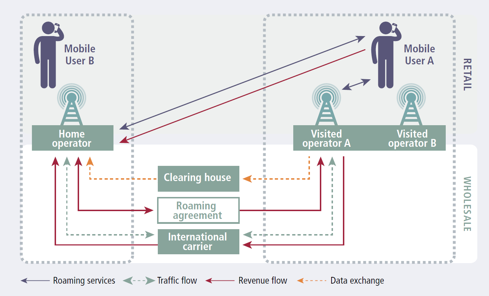

**Figure 1**: Roaming Agreement definition.

The Roaming Agreement addresses the technical and commercial components necessary to enable the service to a Roaming Customer, so that it constitutes an essential part of the business, managing issues such as the management of interoperator charges. Therefore conducting a dynamic and transparent Roaming Agreement drafting process ensures adequate monetization, ensuring the long-term profitability for Telephone companies (TELCO). Transforming this process is seen as the first step of digitizing the roaming agreement processes starting with the drafting and negotiation processes and providing a foundation for the rest of processes including settlement and dispute resolution.

## 3. Roaming Agreement Overview.

To standardize the legal commercial aspects of the Roaming Agreement, the GSM Association broadly outlines the content of such Roaming Agreement in standardized form for its members [2]. Thus, based on these GSMA-defined template standards, MNOs should be concerned with conducting the Roaming Agreement drafting process as part of a negotiation process. On the one hand, during the drafting process of the Roaming Agreement, the parties should analyze the articles contained in the standard templates to determine whether to:

1. Use the article text as found in the template thereby establishing a standard clause.
2. Specify the value of certain variables that are found in a certain text, such as dates, names of entities, amounts, and others.
3. Introduce certain variations in the articles/sub-articles, by specifying different wording or sub articles that fulfills specific operator requirements.
4. Introduce completely new articles/sub-articles that respond to particular interests by constituting customized texts.

   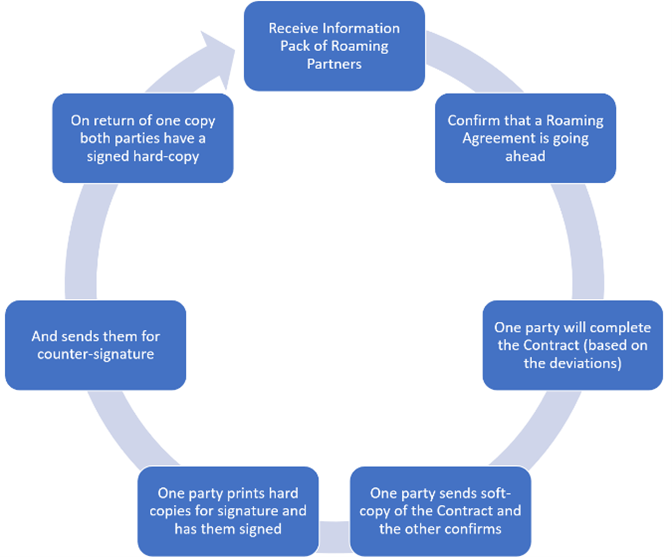

**Figure 2**: Roaming Agreement negotiation stages.

On the other hand, the lifecycle of the Roaming Agreement negotiation process is presented as the compilation of a set of best practices integrated into 7 phases, as illustrated in Figure 2. These phases do not represent standards or rules that must be followed in a mandatory way.

## 4. The Problem: Methods and mechanisms currently available for drafting and negotiating Roaming Agreements.

Despite its importance, the drafting of Roaming Agreements faces two major shortcomings. On the one hand, authoritative voices such as [3], define the process of drafting and negotiating Roaming Agreements as a manual, slow and untrustworthy process, since it is mostly very ‘analog’ with successive exchanges of information between the parties using traditional means such as email or regular mail. Secondly, although GSMA in a recent study has enabled trust mechanisms for Wholesale Roaming Initiative [4], their approach is a rather more general one in terms of negotiation and drafting of the Roaming Agreement. Hence there is a need to establish a framework that provides capabilities such as:

* Provide a fine-grained methodology that digitizes the Roaming agreement drafting process.
* Promote a transparent negotiation process between MNOs.
* Ensure traceability in the Roaming Agreement drafting process.
  
## 5. The Solution: A decentralized blockchain-based platform for the efficient management of Roaming Agreements.

Nowadays, blockchain emerges as an essential technology to ensure transparency, traceability and fine-grained analysis of Roaming Agreement drafting and negotiation. This is because on the one hand, blockchain has the potential to transform business processes in all industries, as it eliminates the need for "middlemen" and manual processes because it can ensure the validity of stored data (such as transactions) which cannot be subsequently modified without the change being visible to all parties. While on the other hand, blockchain includes smart contracts that define the transaction logic that controls the lifecycle of a business object contained in the world state.
Despite the advantages of the technology, a blockchain process is not conceivable without the integration of a set of technologies. Considering that blockchain-based solutions involve cross-technology integration where multiple technology stacks can contribute to solving a business problem, this project aims to constitute a solution that while having as its basis the properties and advantages defined for blockchain technology integrates other technologies such as Natural Language Processing (NLP) technologies with the aim to:
 
1. Build a library of drafting items with a set of variables to be extracted from available templates and previous Roaming Agreements using the NLP Natural Language Processing process.
2. Translate the drafting and negotiation process as a blockchain code in Blockchain to digitize the process and provide a maintainable and actionable copy of the agreement.

## 6. Reference Architecture.

The established objectives are intended to be achieved on the basis of the architecture shown in Figure 3, which describes the role of the participating entities as well as the functionalities they perform throughout the application lifecycle.

   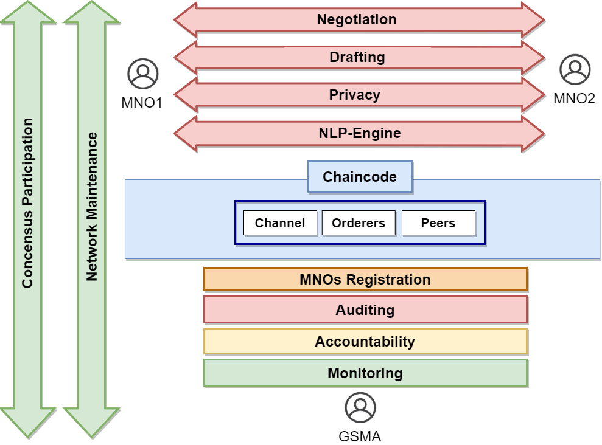

**Figure 3**: Reference Architecture.

To simplify, the architecture diagram below shows the example of the entities participating in an agreement represented by two MNOs and GSMA as the administrator. Among the functions they perform in common are the maintenance of the Hyperledger Fabric Blockchain network and participation in the network consensus, so that each of the three entities will contain a peer node with the ledger and chaincode and an ordering node. Likewise, all entities will be linked to the same channel. In addition to the common functions, there are functions that the MNOs perform among themselves and others that are only performed by the GSMA. Thus, while the MNOs negotiate and draft the Roaming Agreement, maintaining the privacy of the information and uses the NLP Engine to create a template to be used as part of the drafting process, while the GSMA role is mainly limited to the Registration of MNOs, the Network Monitoring and the Audit and Accountability of the Roaming Agreement conducted between the two MNOs.

### 6.1 Application lifecycle

Once the reference architecture has been defined, including the main components and functionalities that are part of the project, the base lifecycle of the application is defined. Figure 4 shows a first approximation of the application life cycle involving the three entities mentioned previously. In this sense, four stages have been defined as part of the life cycle. The first one starts when two MNOs enable a Roaming Agreement principle through a document that could be shared with the GSMA as central authority. At this point, GSMA is able to create the Roaming Agreement Output Template (RAOT) via NLP Engine execution. The second implies that once the GSMA loads the RAOT to the platform to manage the Roaming Agreement, it must enable the MNOs, who will be able to register themselves on the HFB before starting the negotiation and drafting of the roaming agreement. The third stage contains the Roaming Agreement drafting process. Although in Figure 4, only 3 processes are represented, any combination that includes to add the article, to accept the article, to propose changes in the article and to reject the article, can be performed. Finally, the fourth stage consists of the proposal to reach an agreement, as well as acceptance of the scope of the agreement.

   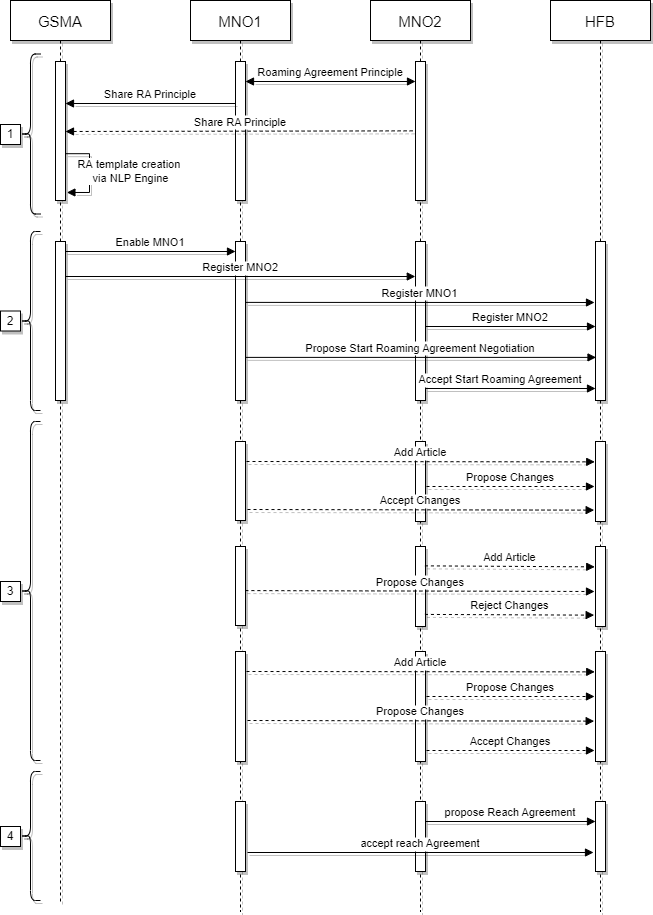

**Figure 4**: Application lifecycle.

## 7. Architecture Design Details

In the next sections, the details of both the NLP engine and the chaincode are presented, first by talking on the concept of the NLP engine and then describing the chaincode implementation.

### 7.1. NLP-Engine design

Section 3 defined the four features to be analyzed, which can be summarized as follows:

1. Leave an article/sub-article as found in the template thereby establishing a standard clause.
2. Introduce certain variations in the articles/sub-articles, by changing variables, e.g., MNO, dates, penalties, currencies, and so on concerning the original text, i.e., the GSMA templates.
3. Introduce completely new articles/sub-articles that respond to particular interests by constituting customized texts.
4. Specify the value of certain variables that are found in a certain text, such as dates, names of entities, amounts, and others.

To determine as accurately as possible the presence of these four characteristics as part of each of the articles that make up the Roaming Agreement in this project, a tool for text processing and analysis based on Natural Language Processing (NLP) has been designed, which is hereinafter referred to as the NLP engine.

The logic designed for the NLP Engine has two approaches: detection and comparison.

* Detection represents the location of variables in the Roaming Agreement.
* Comparison is performed between each sub-article present in the Roaming Agreement concerning the sub-articles present in the GSMA template.

While a near-total coincidence between texts at the sub-article level represents a standard clause, a near-zero coincidence between texts (or simply the non-existence of the sub-article) represents a customized text. The intermediate case is represented by the variation where there is a high coincidence and the differences are given by the presence of variables such as MNO, date, currencies, etc.

### 7.2. Chaincode design.

From a design point of view, the chaincode is defined by actions and statuses, where interactions through actions allow the transition between each of the statuses. The statuses represent the different phases and transitions starting with the enabling of a Mobile Network Operator (MNO) until it reaches the final signed Roaming Agreement with another counterparty, MNO. Therefore, it is necessary to put the focus on the statuses that govern the chaincode. Thus, the chaincode for Roaming Agreement negotiation consists of three stages: (1) Statuses for Roaming Agreement Negotiation, (2) Statuses for the Articles Negotiation and (3) Statuses for the Article Drafting.

The Statuses for Roaming Agreement Negotiation allows the negotiation to be conducted at the highest level, to determine when the final version of the Roaming Agreement is reached. Without being too rigorous with each of the transitions that take place, each of the states that make up this stage is shown in Figure 5. Thus, in the initial status, the MNOs must be enrolled, which enables either of the two MNOs participating in the negotiation to propose to initiate the Roaming Agreement drafting process. Once the initiation of the agreement is confirmed, the negotiation of the drafting of articles and sub-articles proceeds, where the other stages are involved, ending with a proposal and confirmation of acceptance of the Roaming Agreement.

   

**Figure 5**: Statuses for Roaming Agreement Negotiation.

The negotiation at the articles level is an intermediate stage to determine whether all the articles belonging to the Roaming Agreement have reached the status of being accepted by both parties. Thus, as shown in Figure 6, belonging to the Statuses for the Article Drafting stage, once an article is added, it goes through a transition of proposed changes until finally the article is accepted by both parties.

   

**Figure 6**: Statuses for Roaming Agreement Negotiation.

However, the fact that all articles are in accepted status by both MNOs at a given time does not necessarily imply that the Roaming Agreement is close to being reached, but both entities may intend to add a new article despite that all currently added articles are in an accepted status. For this purpose, the Statuses for the Articles Negotiation stage exists. As shown in Figure 7, the function of this stage is to control the status of all articles added. For this, it establishes a transient status that determines that all added articles are accepted. On the one hand, this stage allows continuing the article drafting process if a new article is proposed. On the other hand, this stage allows moving towards the achievement of the final version of the Roaming Agreement.

   

**Figure 7**: Statuses for the Articles Negotiation stage.

As mentioned previously, the transition between states is due to the interaction between the two parties through the identified actions. From a programming point of view, the actions are performed through chaincode methods, which are invoked or queried using the frontend application through a middleware/backend service. Table 1 defines the set of design methods that are part of the chaincode.

   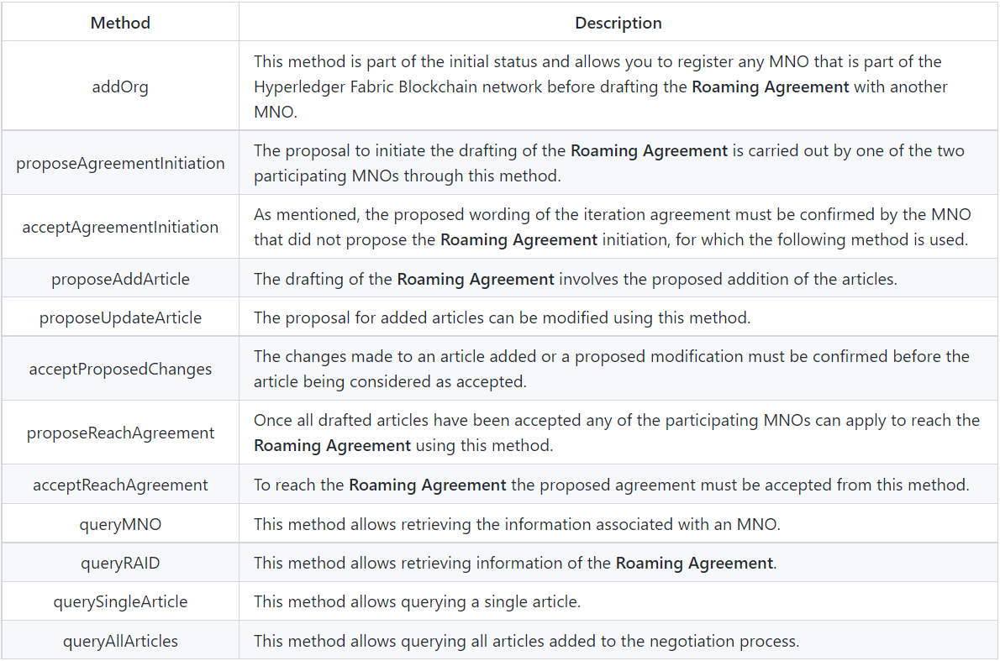

**Table 1**: Method definitions in the chaincode lifecycle.

## 8. Architecture Implementation details.

The project implementation is based on a set of microservices using the Docker infrastructure as a base (see Figure 8). To illustrate how this would work, 3 entities have been established, 2 MNOs and the GSMA as the central authority that manages the MNOs registration and approval of enrollment in the network and provides service assurance and monitoring of the blockchain network. Implementation details can be found in the [project repository](https://github.com/sfl0r3nz05/NLP-DLT).

The following is a brief description of the services common for all participants:

1. **Orderer**: Orderer constitutes the mechanism by which applications and peers interact with each other to ensure that every peer’s ledger is kept consistent with each other.
**Peer**: Peers form the basis for a blockchain network, hosting ledgers and smart contracts (chaincode) which can be queried and updated by peer-connected applications.
2. **Channel**: Channels constitute a mechanism by which a set of components within a blockchain network can communicate and transact privately.
3. **Hyperledger Fabric Blockchain (HFB) Infrastructure**: HFB infrastructure consists of the integration of the three services described above.
4. **Elasticsearch**: Elasticsearch is a search engine based on the Lucene library. It provides a distributed, multitenant-capable full-text search engine with an HTTP web interface and schema-free JSON documents.
5. **Beat**: Agent used for collecting and capturing data from peers and transferring that information to Elasticsearch.

The following is a brief description of the services only maintained by GSMA:

1. **Frontend**: User-friendly interface to carry out the negotiation of roaming agreement drafting.
2. **Backend API**: Container containing the API that allows invoking transactions from the Frontend.
3. **NLP-Engine**: Infrastructure designed with the objective of performing a first processing of pre Itinerancy Agreement between two MNOs that will serve as a template for the drafting and negotiation process on the defined blockchain infrastructure.
4. **Kibana**: Centralized graphical interface used for the purpose of monitoring the Hyperledger Fabric Blockchain network. For that purpose it receives the information from the Elasticsearch Cluster.
5. **Grafana**: Tool used to visualize the API monitoring process.
6. **Prometheus**: Tool used to collect data from the API and send it to Grafana.
7. **Swagger**: Tool used for API documentation.

As these are the two most important parts of the project development, we will now focus on the implementation of both the NLP engine and chaincode.

   

**Figure 8**: Implemented architecture based on microservices.

### 8.1. NLP Implementation.

The overall architecture of the NLP Engine is built over a docker infrastructure, establishing as inputs the Roaming Agreement drafts, as well as the GSMA templates. The processing layer is the logic identified as the  NLP Engine and as output is the classification of articles in standard clauses, variations, customized texts, and variables. This is shown in Figure 9. A very important component in the NLP engine is the Amazon Comprehend service that uses machine learning to uncover valuable insights and connections in text. Throughout the Amazon Comprehend tool Roaming Agreement text is processed to extract key phrases, entities and sentiment for further analysis.

   

**Figure 9**: Architecture implemented for the NLP engine.

#### 8.1.1. Detection of Variables

Variable detection goes through the following steps:

1. A parsing of the Roaming Agreement document converted into text is carried out, removing undesired and noisy characters.
2. The parsed text is divided into groups of 100 words, from which entities, key phrases, and syntax are detected using the Amazon Comprehend service [1].
3. Post-processing mechanisms are applied based on the combination of the detected elements, i.e., entities, key phrases, and syntax.

#### 8.1.2. Analysis based on Amazon Comprehend.

Entities, key phrases, and syntax are detected using Amazon Comprehend service. The agreement text is split into  pieces of text (e.g. 100 words) sent to the Amazon Comprehend tool via REST API call that returns a list of objects as shown in expression (1). When the entities have been detected, his information is combined with processing and validations based on expression (2) and expression (3), allowing to determine variables. To further clarify, expression (2) constitutes an object of the list of objects returned by Amazon Comprehend when key phrases are detected. Expression (3) constitutes an object of the list of objects returned by Amazon Comprehend when syntax analysis is performed.

Expression (1):
```
{‘BeginOffset’:0,’EndOffset’:8,’Score’:0.43067169189453125,’Text’:’Proximus’,’Type’:’ORGANIZATION’}
```

Expression (2):
```
{‘BeginOffset’:0,’EndOffset’:24, ‘Score’:0.956875205039978,’Text’:’Proximus reference offer’} (2)
```

Expression (3):
```
{‘BeginOffset’: 0,’EndOffset’:8,’PartOfSpeech’:{‘Score’:0.9324524402618408,’Tag’:’PROPN’} (3)
```

#### 8.1.3. Comparisons of sub-articles.

To establish comparisons between text elements a pre-processing step is necessary:

1. A parsing of the Roaming Agreement document converted into text is carried out, removing undesired and noisy characters.
2. The parsed text is divided into articles, which in turn are divided into sub-articles.
3. The sub-articles are used to establish the degree of similarity concerning the reference represented by the GSMA template.
4. In the case that from the similarity analysis it is determined that the sub-article is a variation, then we proceed to look for the respective variables within the variations.

#### 8.1.4. Analysis of Similarities.

Similarity analysis, in this project, consists of comparing the sub-articles of the Roaming Agreement with the sub-articles used as reference. The similarity analysis is based on Jaccard’s similarity [5], which has been selected because of its simplicity of implementation for this stage of the project. However, the way the code of this project has been developed allows using other similarity types such as cosine similarity. Expression (4) also constitutes an object of the list of objects returned by Jaccard similarity when the sub-article 1.1 is compared with one Roaming Agreement concerning the sub-article present in the GSMA template.

Expression (4):
{‘id’: ‘1.1’, ‘similarity’: 0.7380952380952381}

#### 8.1.5. Roaming Agreement Output File with the classification of articles.

Once the variables have been determined, a similarity analysis is carried out to classify the sub-articles into standard clauses, variations and customized texts, as well as the identification of the variables existing within the variations. All the information obtained is populated in the Roaming Agreement Output File in such a way that it constitutes a template that will be used as a basis for drafting the final roaming agreement through the chaincode.

### 8.2. Chaincode Implementation lifecycle.

Figure 10 illustrates part of the set of methods that make up the chaincode life cycle. The invocation of these methods establishes the transition between the different states of the chaincode. This transition takes place at three application levels as detailed in Table 2. The following section focuses on providing details of the different modules that make up the chaincode and that make it possible to carry out the above-mentioned interactions.

   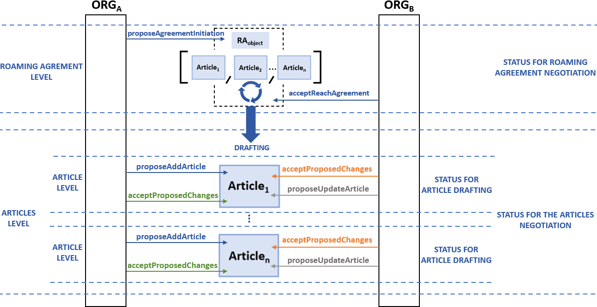

**Figure 10**: Chaincode lifecycle.

   
**Table 2**: States associated with application levels.

#### 8.2.1. Chaincode implementation details.

The chaincode implementation consists of 6 modules as described below:

1. **Proxy**: This module receives the interactions from the off-chain side and routes them to the different points within the chaincode.
2. **Organization**: This module contains all the interactions related to organizations, allowing to create a new organization, querying existing organizations, etc.
3. **Agreement**: This module contains all interactions related to the Roaming Agreement, allowing users to add and update articles by specifying the articles variables values, variations selection and any proposed custom text. Also, this module handles article state transactions (e.g., proposed-to-accepted) and the possible proposed changes.
4. **Identity**: This module is inserted inside the proxy and allows identity verification using the Client Identity Chaincode Library (cid).
5. **Util**: This module contains common functionalities for the rest of the modules, e.g., UUID generation.
6. **Models**: This module contains the definitions of variables, structures and data types supported by the chaincode. In addition, different error types are defined for proper error handling.

The integration between the different modules takes place in each of the methods defined for the HFB chaincode. Considering that the chaincode methods were defined in Table 1, we will now focus on a single method to analyze how the integration between modules takes place. The selected method is proposeAgreementInitiation, which has been defined as the proposal to initiate the Roaming Agreement drafting by one of the two participating MNOs, causing the transition from the initial state to the started_ra as shown in Figure 11:

   

**Figure 11**: Statuses for Roaming Agreement Negotiation with selected status.

Figure 12 below shows the sequence diagram illustrating the relationship between the modules defined above.

   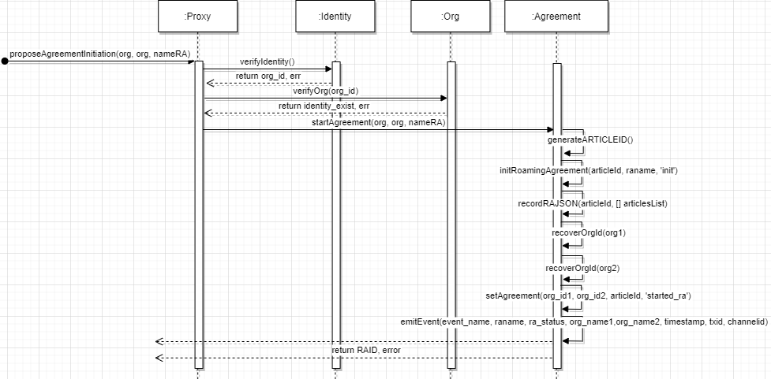

**Figure 12**: Sequence diagram of the proposeAgreementInitiation method.

In this way, a registered MNO enables the drafting of a Roaming Agreement. Thus, the Proxy Module enables interactions with other modules. Firstly, the Identity Module allows verifying the MNO Identity. The Organization Module verifies whether the MNO exists, i.e. has been previously registered. Considering that the names of the two participating organizations and the Roaming Agreement name constitute the input arguments, the Agreements Module performs the following functionalities:

1. Generation of the unique identifier for the list of Articles: articlesId
2. Generation of the unique identifier for the Roaming Agreement: RAID.
3. The started_ra event is emitted.
4. The Status for the Roaming Agreement Negotiation is set as started_ra and contained as part of the emitted event.
5. The Status for the Articles Negotiation is set as init.

The main conclusion we can reach is that each method involves the verification, update, or generation of states, which are stored as parts of the data structures established for the chaincodes and traced thanks to the events emitted from each of the methods.

### 8.3. Integration with Hyperledger Mentoring Programs.

One of the most remarkable points of this project is the integration with other Open Source projects belonging to the Hyperledger Mentoring program. In particular, it has used the Filebeat agent created within the framework of the project "Analyzing Hyperledger Fabric Ledger, Transactions, and Logs using Elasticsearch and Kibana" [6] to display on a Kibana dashboard the transactions executed on our network.

## 9. Graphical Interface Details.

The contextualization of the designed and implemented architecture involves obtaining a set of user-friendly graphical interfaces capable of enabling the appropriate Management of the Roaming Agreement Drafting and Negotiation process, and the Monitoring of HFB network transactions.

### 9.1. Management of the Roaming Agreement drafting and negotiation process.

Some pieces of the visualization interface of the roaming agreement drafting process are included in this document. The details of the transition between states, until closing the roaming agreement between two registered MNOs can be seen through a [demonstration video](https://youtu.be/5Oas8EMk0lw).

   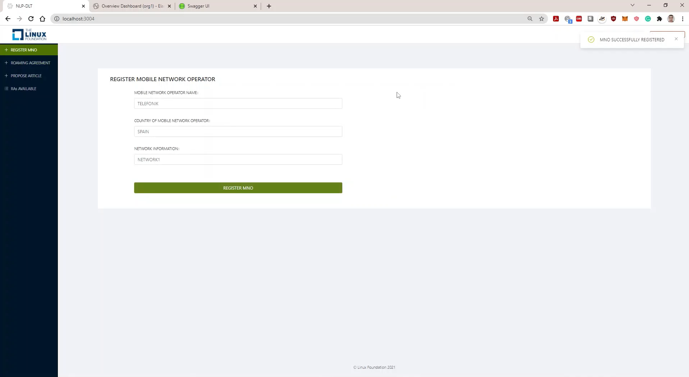

**Figure 13**: MNO registration.

   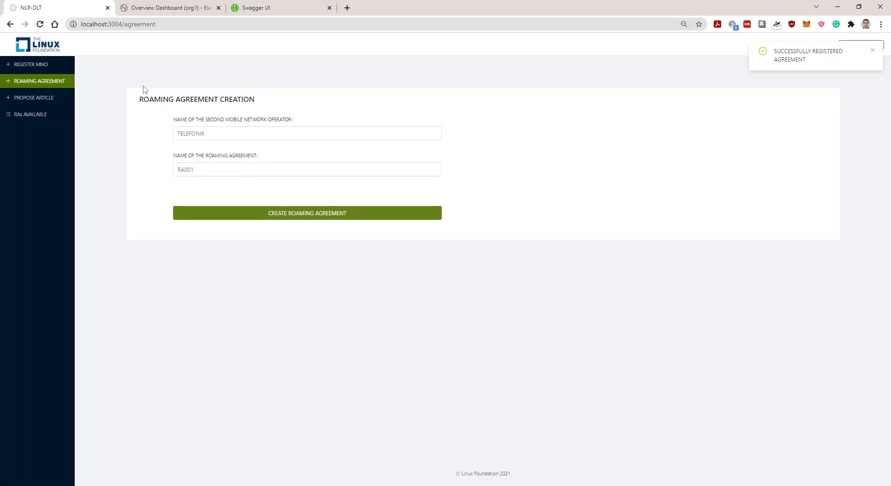

**Figure 14**: Roaming Agreement registration.

   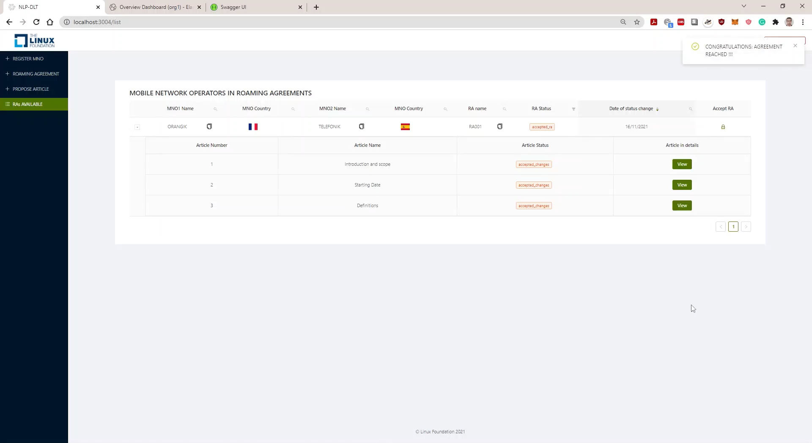

**Figure 15**: Roaming Agreement reached.

### 9.2. Monitoring of HFB transactions.

Based on the integrated Hyperledger mentorship project, we have been able to visualize the transactions committed into the ledger.

   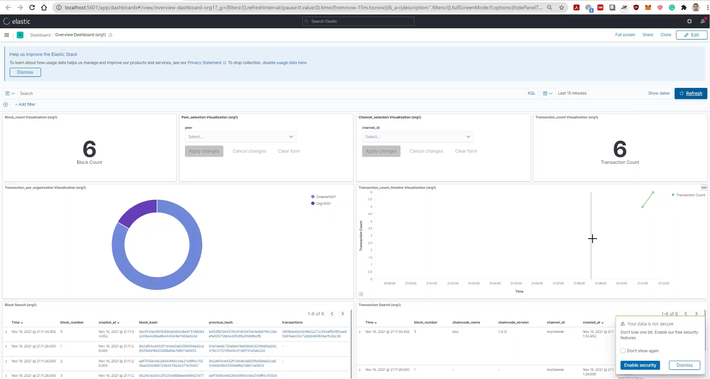

**Figure 16**: Transaction committed into the ledger.

   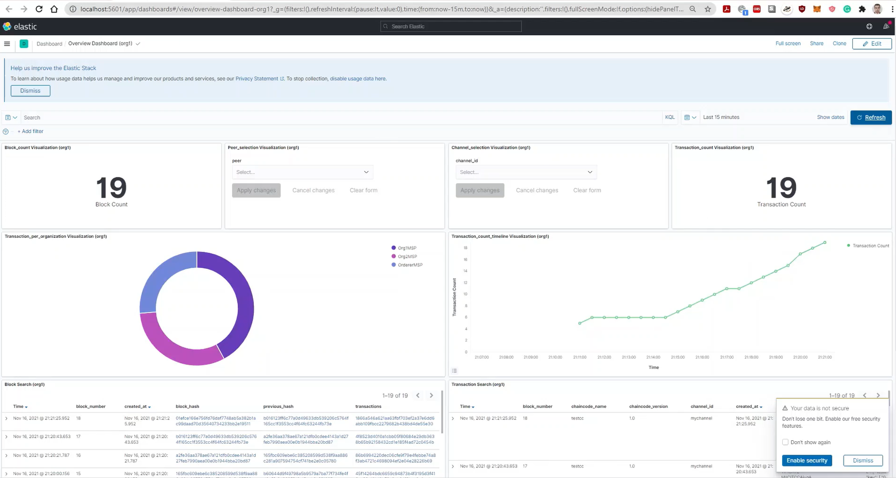

**Figure 17**: Transaction committed into the ledger.

## 10. Future works.

1. The Natural Language Processing phase has been carried out from the construction of a NLP engine, so a future line of work is the construction of a Model based on open source libraries such as Spacy.
2. A drafting library in JavaScript, packaged and published as an NPM package.
3. Full API monitoring with Prometheus and Grafana.
4. Contextualization of the traceability of the Roaming Agreement negotiation between two MNOs through a visualization tool.
5. Definition and establishment of an audit and accountability layer for the system.
6. Ensure information privacy between MNOs through Private Data Collections.

## 11. Publications that support the project.

The project is supported by two types of publications: Medium Articles and Scientific Contributions.

### 11.1 Medium Articles that support the project

The project has been documented through the following Medium articles:

1. [Blockchain-based digitization of the roaming agreement drafting process](https://medium.com/@sfl0r3nz05/blockchain-based-digitization-of-the-roaming-agreement-drafting-process-dec003923521)
2. [NLP Engine to detect variables, standard clauses, variations, and customized texts](https://medium.com/@sfl0r3nz05/nlp-engine-to-detect-variables-standard-clauses-variations-and-customized-texts-893ff9f903e5)
3. [Chaincode design for managing the drafting of roaming agreements](https://medium.com/@sfl0r3nz05/chaincode-design-for-managing-the-drafting-of-roaming-agreements-73d3ed1b3645)
4. [Chaincode implementation for managing the drafting of roaming agreements](https://medium.com/@sfl0r3nz05/chaincode-implementation-for-managing-the-drafting-of-roaming-agreements-d4ec7363a3d0)

### 11.2 Scientific Contributions that support the project
1. A Natural Language Processing Approach for the Digitalization of Roaming Agreements
   - Sent to the Conference: [ILCICT 2021](https://lit.ly/en/ilcict/) (Current status): Under review

## 12. References
  1. I. Tanaka, “Volte roaming and interconnection standard technology”, NTT Docomo Technical Journal, vol. 15, no. 2, pp. 37–41, 2013.
  2. GSMA, “Direct Wholesale Roaming Access Agreement Version 2.7 08 December 2017,” London, 2019.
  3. ROCCO Research, "The International Roaming Agreement", online available: https://www.roccoresearch.com/portfolio-items/the-roaming-agreement/, 2017.
  4. Shamit Bhat, "Blockchain for Wholesale Roaming Initiative", online available: https://www.gsma.com/newsroom/wp-content/uploads//GSMA-Blockchain-for-Wholesale-Roaming-MVP-Report.pdf, October 2021.
  5. S. Gupta, “Overview of Text Similarity Metrics in Python,” May 15, 2018, 2018. [Online]. Available: https://towardsdatascience.com/overview-of-text-similarity-metrics-3397c4601f50. [Accessed: 24-Jul-2021].
  6. Balazs Prehoda and Salman Baset, "Analyzing Hyperledger Fabric Ledger, Transactions, and Logs using Elasticsearch and Kibana", 2019, Online]. Available: https://wiki.hyperledger.org/display/INTERN/Analyzing+Hyperledger+Fabric+Ledger%2C+Transactions%2C+and+Logs+using+Elasticsearch+and+Kibana.